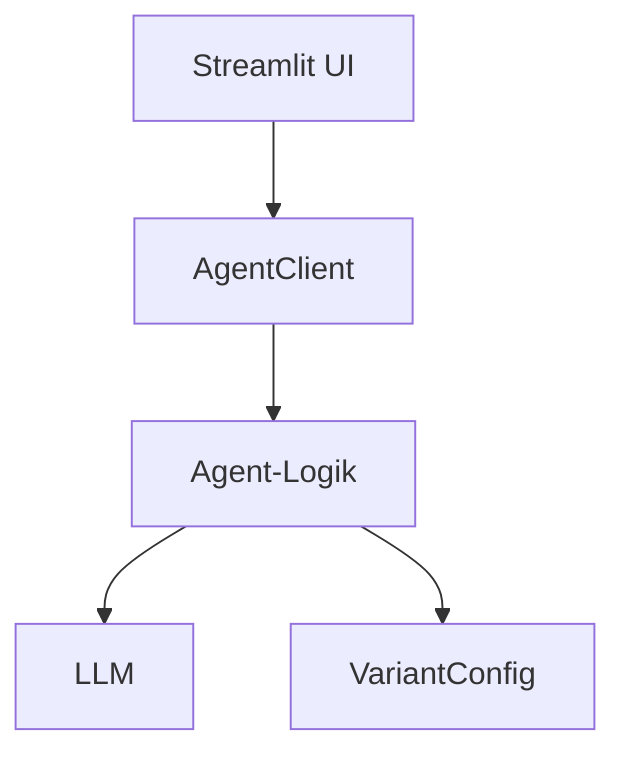

# Neuen Agent im ASTK anlegen – Schritt-für-Schritt-Dokumentation

Diese Anleitung beschreibt, wie ein neuer Agent im Agent Service Toolkit (ASTK) erstellt und angebunden wird. Als Referenz dienen [src/Skill_Companion.py](src/Skill_Companion.py) und [src/agents/skillcompanion_interrupted.py](src/agents/skillcompanion_interrupted.py).

## Architekturüberblick



## Voraussetzungen
- Python-Umgebung eingerichtet (uv oder pip)
- Zugriff auf den Agent-Service (Backend) und gültiges Login über Auth
- Basis-Umgebungsvariablen gepflegt; siehe [.env.example](.env.example)
- Optional: Docker/Compose bei Bedarf; siehe [compose.yaml](compose.yaml) und [docker/](docker/)

## Komponenten und Begriffe
- Frontend: Streamlit-App, z. B. [src/Skill_Companion.py](src/Skill_Companion.py)
- Agent-Logik: LangGraph-Workflow, z. B. [src/agents/skillcompanion_interrupted.py](src/agents/skillcompanion_interrupted.py)
- Client: Kommunikation UI <-> Service, siehe [src/client/](src/client/)
- Variantenkonfiguration: YAML/Schalter, siehe [src/variants/](src/variants/)
- Prompts: Textbausteine, siehe [src/agents/prompts/](src/agents/prompts/)
- Fragenkataloge: JSON/Varianten, siehe [src/agents/agents_questions/](src/agents/agents_questions/)

## Datei- und Namenskonzept
- Agenten liegen unter [src/agents/](src/agents/)
- Prompts unter [src/agents/prompts/](src/agents/prompts/)
- Fragenkataloge unter [src/agents/agents_questions/](src/agents/agents_questions/)
- Varianten unter [src/variants/](src/variants/)
- UI-Dateien unter [src/](src/)

---

## Schritt 1: Agent-Logik anlegen
Ziel: Eine neue Agent-Datei erstellen, die den Dialogfluss abbildet.

1. Lege eine neue Datei an, z. B. [src/agents/my_new_agent.py](src/agents/my_new_agent.py)
2. Implementiere einen zustandsbasierten Ablauf mit LangGraph nach dem Vorbild von [src/agents/skillcompanion_interrupted.py](src/agents/skillcompanion_interrupted.py)
3. Der Agent benötigt typischerweise:
   - Einen State mit Feldern für Nachrichten, Fragen, Antworten, Kategorie, Flags
   - Knoten zur Erzeugung der nächsten Frage
   - Knoten zur Auswertung/Kategorisierung nach Erreichen des Limits
   - Knoten zur finalen Ausgabe
4. Der kompilierte Graph muss einen sprechenden Namen erhalten (z. B. my_new_agent) und als Variable exportiert sein
5. Das Modell wird über die zentrale Hilfsfunktion geladen; siehe [src/core/llm.py](src/core/llm.py) und [src/core/__init__.py](src/core/__init__.py)

Hinweise:
- Prompts und Limits niemals hart codieren, sondern über VariantConfig bereitstellen
- Fehler sauber loggen; siehe Logger-Verwendung im Vorbildagenten

## Schritt 2: Prompts vorbereiten
Ziel: Trennung von Logik und Prompt-Text.

1. Lege einen System-Prompt im Verzeichnis [src/agents/prompts/](src/agents/prompts/) an, z. B. my_agent_ask_question_prompt.txt
2. Optional: Weiteren Prompt für die Kategorisierung, z. B. my_agent_categorize_user_prompt.txt
3. Achte auf klare Platzhalter (z. B. question_count, questions_json, answers_json), die in der Logik gefüllt werden

Referenz: [src/agents/prompts/skill_companion_ask_question_prompt.txt](src/agents/prompts/skill_companion_ask_question_prompt.txt) und [src/agents/prompts/categorize_user_prompt.txt](src/agents/prompts/categorize_user_prompt.txt)

## Schritt 3: Fragen konfigurieren
Ziel: Fragenkatalog verwaltbar halten.

Es gibt zwei gängige Wege:
- Über die Variantenkonfiguration direkt als Liste hinterlegen
- Einen JSON-Katalog pflegen und über die Variante referenzieren, z. B. [src/agents/agents_questions/skill_questions.json](src/agents/agents_questions/skill_questions.json)

Stelle sicher, dass die Variante einen Schlüssel für die Fragen bereitstellt (z. B. skill_questions) und ein Frage-Limit (question_limit).

## Schritt 4: Variante definieren
Ziel: Verhaltensschalter und Ressourcen an zentraler Stelle.

1. Erstelle ein neues Unterverzeichnis, z. B. [src/variants/my_agent/](src/variants/my_agent/)
2. Lege eine Datei default.yml an, die u. a. folgende Schlüssel enthält:
   - title, app_icon, model
   - agent (Muss exakt dem Backend-Agentnamen entsprechen)
   - question_limit
   - ask_question_prompt_filename
   - skill_questions (inline oder Pfad)
   - teaser_active (optional)
   - ai_message_avatar_filename (optional)
3. Beispielvarianten siehe [src/variants/skill_companion/](src/variants/skill_companion/)

## Schritt 5: UI/Streamlit-App anlegen oder erweitern
Ziel: Bedienoberfläche für den neuen Agenten.

1. Erstelle eine neue Streamlit-Datei, z. B. [src/My_Agent.py](src/My_Agent.py)
2. Verwende das Muster aus [src/Skill_Companion.py](src/Skill_Companion.py): 
   - Session-State initialisieren (UI-Schalter, run_id, thread_id, Avatare)
   - Login via Auth sicherstellen
   - AgentClient initialisieren und den Agent-Namen setzen
   - Variante laden (VariantIdentifier) und Modellvalidierung durchführen
   - Nachrichtenverlauf zeichnen und Eingaben verarbeiten
3. Setze den Agenten-Namen im Client exakt, z. B.: my_new_agent

Optional: Evaluation-Dialog einblenden; siehe [src/streamlit_utils/evaluation_ui.py](src/streamlit_utils/evaluation_ui.py)

## Schritt 6: Agent im Backend registrieren
Ziel: Agent über die Service-API verfügbar machen.

1. Füge den neuen Agenten in der zentralen Agenten-Registry hinzu; siehe [src/agents/agents.py](src/agents/agents.py)
2. Importiere die Kompilat-Variable deines Agents und trage sie in die verfügbare Liste/Dikt ein
3. Prüfe, dass der Name im Backend mit der UI-Konfiguration übereinstimmt

## Schritt 7: End-to-End-Konfiguration prüfen
Ziel: Konsistenz sicherstellen.

- Stimmen Agentenname in:
  - UI (AgentClient.agent)
  - Variante (agent)
  - Backend-Registry
- Existieren und sind lesbar:
  - Prompts
  - Fragenkataloge
  - Variantendatei
- Sind notwendige Umgebungsvariablen gesetzt; siehe [.env.example](.env.example)

## Schritt 8: Tests ergänzen
Ziel: Funktions- und Regressionstests.

- Agentenlogik: eigener Test unter [tests/agents/](tests/agents/)
- Service-Integration: siehe [tests/service/](tests/service/)
- Streamlit-UI: siehe [tests/app/](tests/app/)

Referenztests: [tests/agents/test_skillcompanion_interrupted.py](tests/agents/test_skillcompanion_interrupted.py)

## Schritt 9: Implementierung ins Taskfile:
Ziel: Start des Agents mit der UI über Taskbefehle.

Für jeden neuen Frontend-Agenten kann ein eigener Task nach dem Muster `run-sc` ergänzt werden (siehe Kommentar in der Taskfile.yml). 
Die Tasks nutzen Umgebungsvariablen aus `.env` und unterstützen Parameter wie `VARIANT` (z. B. `task run-sc -- VARIANT=my_variant`).

**Beispiel für einen neuen Agenten-Task:**
```yaml
run-myagent:
  cmds:
    - uv run src/theme_selector.py --app My_Agent --variant {{ .VARIANT | default "default" }}
    - uv run streamlit run src/My_Agent.py
```
**Hinweis**
Der Befehl für den theme_selector wird nicht benötigt bei dem lokalen Testen, aber beim Deployment wird er benötigt.

## Schritt 10: Lokaler Smoke-Test
Ziel: Manuelles End-to-End.

1. Backend starten (task run)
2. UI starten (task run-xx (xx ersetzen durch sc = Skillcompanion oder dr=Dwh-Readiness-Check))
3. Mit gesetzter Variante starten (ENV VARIANT oder URL-Parameter)
4. Login durchführen und Dialog einmal vollständig durchlaufen

## Schritt 11: Optional – Evaluation aktivieren
Ziel: Auswertungen im UI nutzen.

- UI-Schalter und URL-Parameter beachten (z. B. show_evaluation)
- Admin-Rechte prüfen; siehe Prüflogik in [src/Skill_Companion.py](src/Skill_Companion.py)

## Schritt 12: Deployment-Hinweise
- Relevante Umgebungsvariablen:
  - BACKEND_URL (oder HOST/PORT)
  - VARIANT
  - HUBSPOT_URL (optional, für Link-Erzeugung)
- Docker/Compose verwenden; siehe [compose.yaml](compose.yaml) und [docker/](docker/)

---

## Checkliste
- [ ] Agenten-Logik unter [src/agents/](src/agents/) erstellt
- [ ] Prompts unter [src/agents/prompts/](src/agents/prompts/) abgelegt
- [ ] Fragenkatalog konfiguriert
- [ ] Variante unter [src/variants/](src/variants/) definiert
- [ ] UI-Datei erstellt/erweitert und Agent gesetzt
- [ ] Backend-Registry aktualisiert
- [ ] Tests ergänzt und grün
- [ ] Taskfile anpassen
- [ ] Smoke-Test erfolgreich


## Anhang: Nützliche Referenzen im Repo
- UI-Beispiel: [src/Skill_Companion.py](src/Skill_Companion.py)
- Agent-Beispiel: [src/agents/skillcompanion_interrupted.py](src/agents/skillcompanion_interrupted.py)
- Varianten: [src/variants/](src/variants/)
- Prompts: [src/agents/prompts/](src/agents/prompts/)
- Fragenkataloge: [src/agents/agents_questions/](src/agents/agents_questions/)
- Tests (Agent): [tests/agents/](tests/agents/)
- Tests (Service): [tests/service/](tests/service/)
- Tests (App): [tests/app/](tests/app/)